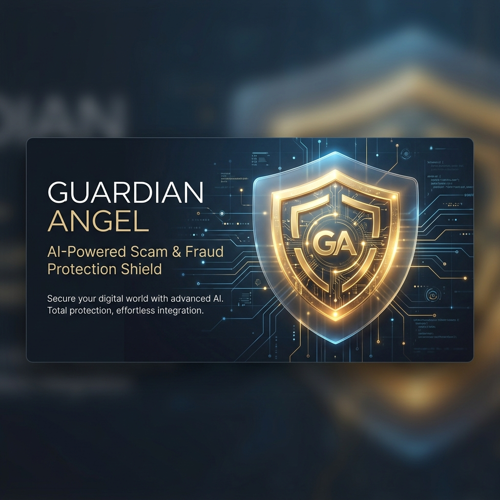
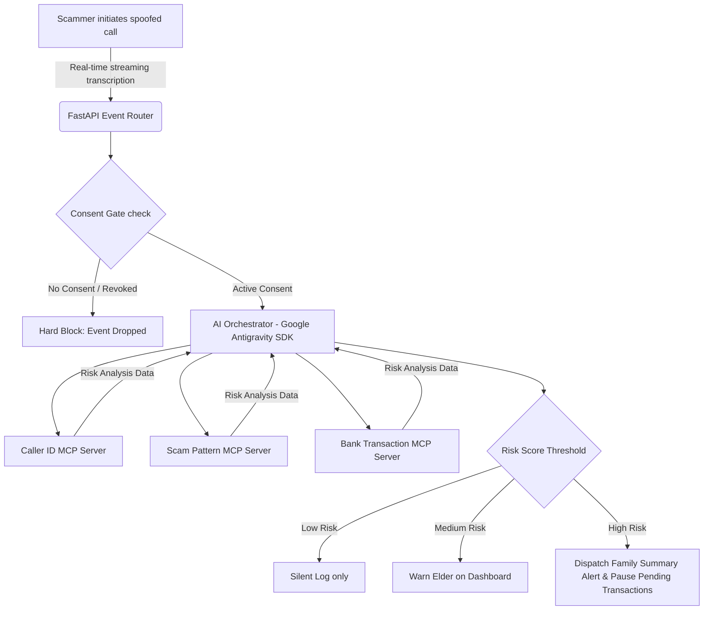

<div align="center">



# 🛡️ GUARDIAN ANGEL
### **The Real-Time Scam & Fraud Shield for Older Generations**

[](https://fastapi.tiangolo.com/)
[](https://github.com/google/antigravity)
[](https://modelcontextprotocol.org/)
[](https://python.org)
[](LICENSE)

**Guardian Angel** is an autonomous AI-driven defensive security layer designed to shield vulnerable older family members from telephone scam networks, spoofed callers, and financial elder abuse. Leveraging real-time streaming text analysis, a programmatic Zero-LLM Consent Gate, and a multi-agent tool ecosystem powered by the **Google Antigravity SDK**, Guardian Angel intervenes to alert families and pause fraudulent transactions before the damage is done.

[**🌐 Live System Demo**](#-quick-start) | [**🏗️ Architecture Guide**](docs/ARCHITECTURE.md) | [**🛡️ Security Model**](docs/SECURITY.md) | [**🔌 API Reference**](docs/API.md)

</div>

---

## 📖 The Story: Why We Built Guardian Angel

Imagine your grandmother receives a phone call. The caller ID displays "IRS Fraud Department." A firm, urgent voice on the other end warns her that her bank account has been compromised due to suspicious activity, and she must move her savings to a "secure government vault" immediately. 

She is told: *“Do not hang up. Do not speak to your family. This is an active investigation.”*

In less than 30 minutes, a lifetime of savings is wired to a scammer’s account. This is not a hypothetical scenario—**elder fraud accounts for over $3 Billion in losses annually in the US alone**, targeting the trust, isolation, and cognitive decline of older adults.

Existing solutions are either reactive (reporting after the loss) or overly intrusive (recording audio, violating privacy, or locking elders out of their own devices). **Guardian Angel is different.** It processes rolling live transcripts (never audio), filters data to enforce privacy, and puts absolute control in the hands of the elder while keeping the family connected in high-risk scenarios.

---

## ⚡ The Narrative: Problem ➔ Solution ➔ Impact



### 🔴 The Problem
Traditional telephone scam filters fail because they rely on simple spam lists. Scammers bypass them by spoofing numbers, creating urgent scenarios (arrest threat, relative in trouble), and pressuring victims to wire funds, buy gift cards, or grant remote desktop access.

### 🟢 The Solution
An intelligent, real-time protection mesh that:
1. **Listens to transcripts, not voices**: Telephony stream inputs are parsed dynamically. No voice or biometric data is collected.
2. **Employs Multi-Agent verification**: Using the Model Context Protocol (MCP), specific microservices check caller legitimacy, match known scam tactics, evaluate urgency indicators, and pause suspicious transactions.
3. **Puts the elder in control**: High-contrast, accessibility-first controls allow elders to instantly revoke permission.

### 🔵 The Impact
- **Immediate intervention**: Transactions are paused *before* clearance.
- **Family peace of mind**: Families get real-time context summaries without surveillance.
- **Elder dignity**: Safe autonomy is maintained. The elder decides when the shield is active.

---

## 🛡️ Key Innovations ("Why We're Different")

### 1. The Programmatic Consent Gate (Hard Security Block)
Most AI safety systems rely on "system instructions" or LLM prompts to enforce privacy. Guardian Angel features a **hard, code-level Consent Gate** ([consent_gate.py](file:///Users/anushkasharma/Desktop/Guardian%20Angel/consent/consent_gate.py)) built directly into the event loop.
- **LLM-Bypass Prevention**: The check runs *before* any text is forwarded to the AI orchestrator or MCP tools. Prompt injections or adversarial transcripts cannot trick the model into bypass.
- **Instant Revocation**: If the elder taps the "Revoke Consent" button, database states update instantly. All stream processing drops immediately, and subsequent API calls return a hard HTTP 403.

### 2. Double-Blind Privacy Model
Elders see full transcripts and precise alerts on their high-contrast dashboard. Family members see **summaries only** (e.g., *"Potential Social Security Scam detected. Urgency indicators high."*). Raw conversations and personal details never leave the elder’s trust boundary.

### 3. Multi-Agent Model Context Protocol (MCP) Mesh
Using the Google Antigravity SDK, the system orchestrates four specialized stdio-based MCP servers:
* **`scam-pattern-server`**: RegEx & linguistic pattern matching for tactics like IRS impersonation, romance scams, and tech support viruses.
* **`caller-id-server`**: Cross-references numbers against scam databases and validates claimed company/agency identities.
* **`bank-transaction-server`**: Flags transfers to unverified recipients and score-pauses transactions.
* **`family-alert-server`**: Triggers immediate alerts via text/dashboard without leaking transcripts.

---

## 📊 The AI/ML Pipeline & Risk Scoring

Guardian Angel utilizes the **Google Antigravity SDK** to run the orchestration loop. The agent processes incoming chunks and runs parallel MCP tools to output a structured [RiskDecision](file:///Users/anushkasharma/Desktop/Guardian%20Angel/database/models.py#L97) schema:

$$\text{Combined Risk Score} = 0.4 \times \text{Scam Pattern Score} + 0.3 \times \text{Caller Verification Score} + 0.3 \times \text{Urgency Pressure Score}$$

### Scoring Matrix

| Indicator | Low Risk (0-29) | Medium Risk (30-69) | High Risk (70-100) |
| :--- | :--- | :--- | :--- |
| **Scam Phrases** | Natural conversation | Keywords like "virus," "remote support," "lottery fee" | Phrases like "warrant for arrest," "transfer to safe account" |
| **Caller ID** | Whitelisted contact | Unknown caller / VoIP number | Spoofed number masquerading as a major bank / IRS |
| **Urgency/Pressure** | Relaxed | Prompting action today | "Keep this secret," "Do not hang up," "Do not tell family" **(Score $\ge 80$)** |

> [!TIP]
> If a monetary transfer (wire, bitcoin, gift cards) is mentioned alongside high urgency, the system activates the `bank-transaction-server` tool `pause_transaction` to lock down outgoing API funds.

---

## 🛠️ Unified Tech Stack

| Component | Technology | Description |
| :--- | :--- | :--- |
| **Core Language** |  | Version 3.11+, typed async codebase |
| **Web Server** |   | Async Event Routers, WebSockets & JWT security |
| **AI Orchestrator** |  | **Google Antigravity SDK** for multi-agent loops & structured outputs |
| **Tool Servers** | **MCP Protocol** | Standalone tool micro-services running via stdio streams |
| **Database** |  | Append-only system audit logs, consent states, session DB |
| **Frontend UI** |    | Glassmorphic CSS variables, high-contrast layouts for elder accessibility |
| **Telephony** |  | Audio media stream hooks and real-time Speech-to-Text translation |

---

## 🚀 Quick Start (Under 60 Seconds)

Get a local sandbox environment running to test the backend, consent gates, and live call simulator.

### 1. Clone & Set Environment
```bash
git clone https://github.com/your-repo/guardian-angel.git
cd guardian-angel
cp .env.example .env
```
*(Open `.env` and configure your `OPENROUTER_API_KEY` for LLM analysis fallback, or use the mock key for checking logic flow).*

### 2. Spin Up Services
We support both native Python and Docker setups.

<details>
<summary><b>Option A: Native Python Installation (Recommended)</b></summary>

```bash
# 1. Create and source virtual environment
python3 -m venv venv
source venv/bin/activate

# 2. Install package dependencies
pip install -r requirements.txt

# 3. Seed demo accounts (Margaret & Sarah)
python demo/seed_data.py

# 4. Fire up the FastAPI server
uvicorn backend.main:app --reload --port 8000
```
</details>

<details>
<summary><b>Option B: Docker Compose</b></summary>

```bash
# Build and run containers
docker-compose up --build
```
</details>

### 3. Test & Replay Scams
1. Open your browser and navigate to **`http://localhost:8000`**.
2. Log in as **Elder (Margaret Johnson)** or **Family Member (Sarah Johnson)** using the seeded credentials.
3. Open a second terminal window and run the live call simulator script to replay an active scam:
   ```bash
   python demo/replay_demo.py --delay 2.0
   ```
4. Watch the alert propagate in real-time, click **"Revoke Consent"** on the elder dashboard, and watch subsequent replay packet streams block immediately!

---

## 📁 Repository Map

```
guardian-angel/
├── agents/                  # AI Orchestrator & prompts
│   ├── orchestrator.py      # Google Antigravity SDK Agent
│   ├── openrouter_proxy.py  # Translate Antigravity schemas to API schemas
│   └── prompts/             # System instruction prompts
├── backend/                 # FastAPI HTTP Server
│   ├── main.py              # Application entry point
│   └── routers/             # API routes (Auth, Consent, Events, Alerts, Audit)
├── consent/                 # Consent enforcement
│   └── consent_gate.py      # Code-level logic blocking LLM processing
├── database/                # SQLite integration
│   ├── db.py                # Database client & async operations
│   └── models.py            # Pydantic schemas
├── demo/                    # Testing sandbox
│   ├── sample_calls.json    # Fake call transcripts (bank, tech support, etc.)
│   ├── replay_demo.py       # Simulates real-time Twilio packet transmission
│   └── seed_data.py         # Seeds default users and tokens
├── frontend/                # Unified glassmorphic frontend views
│   ├── index.html           # Landing & Portal Login
│   ├── onboarding.html      # Three-phase consent handshake
│   ├── elder-dashboard.html # Accessibility layout (shields & big buttons)
│   ├── family-dashboard.html# Risk timelines & summary feeds
│   └── css/styles.css       # Global design token systems
├── mcp_servers/             # Model Context Protocol tools (stdio)
├── telephony/               # Twilio Webhook & WebSockets stream handlers
└── docs/                    # Architectural guidelines & security references
```

---

## 🗺️ Product Roadmap

- [ ] **Phase 1: Local Tool Integration (Completed)**
  - FastMCP tool servers registered with local orchestrator.
  - Interactive call simulator and frontend dashboard demo.
- [ ] **Phase 2: Decentralized Compliance & Scalability**
  - Migrating SQLite audit logs to a tamper-proof decentralized ledger.
  - Adding Multi-Elder linkage support for group care homes.
- [ ] **Phase 3: Native Telecommunications Integration**
  - Direct eSIM integration and partnering with mobile network operators.
  - On-device lightweight models for real-time offline scam filtering.

---

## 👥 The Team

* **Anushka Sharma** — Product Lead & Frontend Developer
* **AI Collaborator (Antigravity)** — Multi-Agent Engineering & Python Integration

---

## 📄 Acknowledgements & License

- Special thanks to the **Google DeepMind Team** for the *Antigravity SDK* allowing elegant multi-agent orchestration.
- The **Model Context Protocol (MCP)** community for simplifying tool-agent communication.
- Distributed under the **MIT License**. Check out [docs/SECURITY.md](docs/SECURITY.md) for vulnerability reporting guidelines.
